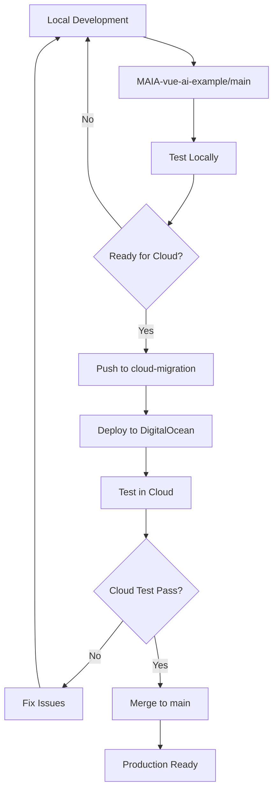

# MAIA Development Flow

## Repository Structure

```
MAIA-Local Repository (Container Orchestration)
├── docker-compose.maia-secure.yml
├── MAIA-SECURE-README.md
├── README.md
└── MAIA-vue-ai-example/ (Git Submodule)
    ├── src/ (Actual Application Code)
    ├── package.json
    ├── server.js
    └── ...
```

## Development Workflow



## Quick Commands

### Local Development
```bash
# Start local development
npm run workflow local-dev

# Start with Docker
npm run workflow local-docker

# View logs
npm run workflow local-logs

# Commit changes
npm run workflow commit-local
```

### Cloud Testing
```bash
# Deploy to cloud
npm run workflow deploy-cloud

# View cloud logs
npm run workflow cloud-logs

# Sync data to cloud
npm run workflow sync-data
```

### Production Release
```bash
# Merge cloud changes back
npm run workflow merge-cloud
```

## Environment Comparison

| Aspect | Local Development | Cloud Environment |
|--------|------------------|-------------------|
| **Database** | Local CouchDB | Cloudant (IBM) |
| **Speed** | Fast (hot reload) | Production-like |
| **Cost** | Free | ~$70-120/month |
| **Control** | Full access | Managed service |
| **Debugging** | Easy | Limited |
| **Security** | Basic | Production-grade |

## Data Flow

```
Local CouchDB ←→ Cloudant
     ↑              ↑
     ↓              ↓
Local MAIA ←→ Cloud MAIA
```

## Branch Strategy

```
main (Local Development)
  ↑
  ↓
cloud-migration (Cloud Testing)
  ↑
  ↓
main (Production)
```

## Key Points

1. **Primary Development**: Always on `main` branch locally
2. **Cloud Testing**: Use `cloud-migration` branch
3. **Data Sync**: Scripts to migrate between environments
4. **Environment Variables**: Separate configs for local/cloud
5. **Fast Iteration**: Local development for quick feedback
6. **Production Testing**: Cloud environment for real-world testing

This workflow gives you the best of both worlds: fast local development with the ability to test in a production-like cloud environment when needed. 